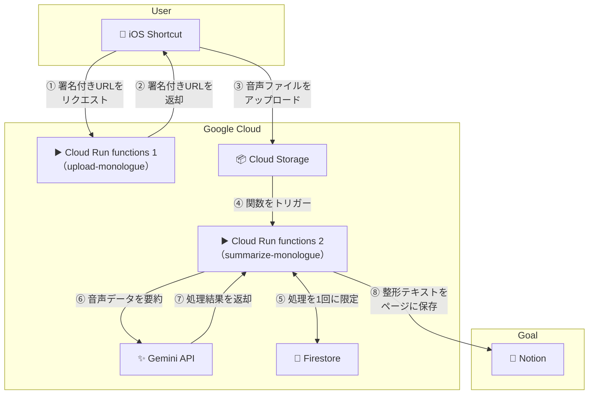
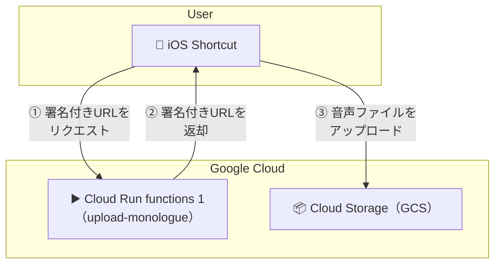
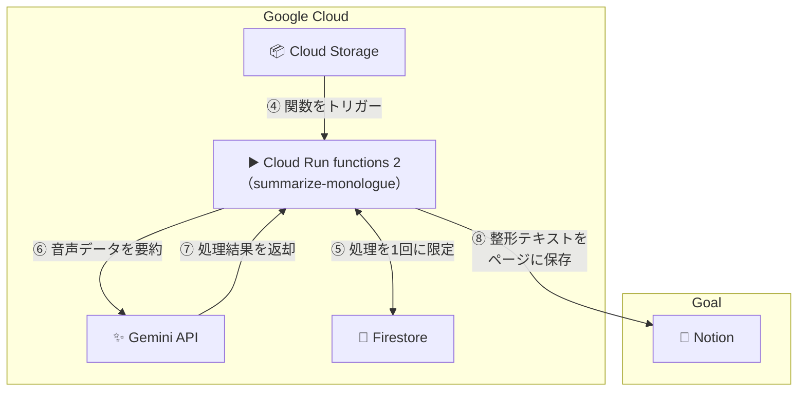

<!-- @format -->

# monologue-muser

## 概要

ひとりごと(monologue) をきれいなメモに整形して Notion に格納するシステム。

## 使い方

1. ボイスメモで考えごとやメモしたいことを話す。
2. 共有メニューから iOS ショートカットを実行。
3. Notion にメモを文字起こししてまとめられた内容が格納される。

※ ボイスメモは`YYYYMMDD_tilte`という命名規則にして、`tilte` 部分を Notion のページ名にするようにしています。

## アーキテクチャ



- iOS ショートカット

  - [こちら]()からダウンロード。
    ※ 許可なく二次配布はご遠慮いただきたいですが、個人利用の範囲内では自由に改造していただいて構いません。

- Cloud Storage (GCS; Google Cloud)

- Cloud Run functions (Google Cloud)

  - Python で実装
  - [Functions Framework](https://cloud.google.com/functions/docs/running/function-frameworks?hl=ja) を使用

  - 1 つ目: upload_monologue
    - iPhone から音声を GCS にアップロード
  - 2 つ目: summarize_monologue
    - GCS に アップロードされた音声ファイルを処理して Notion に格納

- Firestore (Google Cloud)
  - GCS トリガーで Clourd Run functions を実行する際に、Firestore で実行回数を制御しないと、複数回実行されてしまうことがある。
- Gemini

  - Gemini を使用して音声ファイルを文字起こし & 整形
  - 無料枠を活用したいため、Google Cloud の VertexAI ではなく、[Google AI Studio](https://aistudio.google.com/apikey) の API キーを使用。

- Notion

  - [Notion API](https://developers.notion.com/docs/getting-started) で指定したデータベースにデータを挿入。

## セットアップ方法

### 前提

- 本リポジトリをローカルにクローン

```bash
git clone https://github.com/yasu-888/monologue-muser.git
```

- iPhone や iPad を使用

  - iOS ショートカットアプリを使用するため
  - 特定の GCS に音声ファイルをアップロードするリクエストを実行できれば、iPhone 以外からでも使用可能。

- GoolgeCloud プロジェクトを作成済み

  - [こちら](https://cloud.google.com/resource-manager/docs/creating-managing-projects?hl=ja) に沿ってセットアップ

- gcloud CLI をインストール済み

  - [こちら](https://cloud.google.com/sdk/docs/install?hl=ja)よりインストール
  - Cloud Run functions のデプロイ等に使用。
  - なくても構築は可能だが、ある方がコンソールの操作をスキップできる。

### ボイスメモをアップロードする仕組みを構築



1. GCS バケットを作成

   - 任意の名前（世界中で一意である必要がある）

2. GoogleCloud サービスアカウントの作成

   - 任意の名前（例: monologue-muser）

3. サービスアカウントにロールを付与

   - Cloud Datastore ユーザー `roles/datastore.user`
   - Eventarc イベント受信者 `roles/eventarc.eventReceiver`
   - Secret Manager のシークレット アクセサー `roles/secretmanager.secretAccessor`
   - Storage オブジェクトユーザー `roles/storage.objectUser`
   - サービス アカウント トークン作成者 `roles/iam.serviceAccountTokenCreator`

4. Cloud Run functions 1 (upload-monologue) をデプロイ

   ※ デプロイ用に gcloud login しておく

   ```bash
   gcloud auth login
   ```

   ```bash
   cd upload-monologue
   ```

   ```bash
   gcloud run deploy upload-monologue \
   		--source . \
   		--function generate_signed_url \
   		--base-image python312 \
   		--region asia-northeast1 \
   		--memory 512Mi \
   		--timeout 300s \
   		--allow-unauthenticated \
   		--set-env-vars=PROJECT_ID=[GoogleCloudのプロジェクトID],BUCKET_NAME=[GCSバケット名] \
   		--set-build-env-vars=GOOGLE_FUNCTION_SOURCE=main.py \
   		--service-account=[サービスアカウント名]@[プロジェクトID].iam.gserviceaccount.com
   ```

   デプロイ成功後に表示される`https://upload-monologue-xxxxxxxx-an.a.run.app` のような URL をコピー

5. iOS ショートカット初期設定

   - [こちら](https://www.icloud.com/shortcuts/d32c5e50446a440da2784546cb6a5b59)からショートカットをダウンロード
   - Cloud Run functions のエンドポイントを先ほどコピーしたものに設定
   - ショートカット内の `temp` の部分に iPhone 内の任意のフォルダを指定

   **テスト**

   実行してみて、ボイスメモが GCS にアップロードされるかを確認してみてください。

### 音声ファイルを処理する仕組みを構築



1. Firestore コレクションを作成

   1. (default) データベースを作成 ※ (default) 内では無料枠が適用されるため
   2. (default) データベース内に任意の名前（例: monologue-muser）コレクションを作成
   3. TTL ポリシーの有効化（定期的に自動で削除されるように）

      ```bash
      gcloud firestore fields ttls update expire_at --collection-group=[コレクション名] --enable-ttl
      ```

2. Notion データベースページ作成

   1. [こちら](https://www.notion.so/22114409fab580e79d81f4f7eda973e3?v=22114409fab5813487c2000c1e6633b1&source=copy_link) をコピーして出力先となるページを作成
   2. ページの URL からデータベース ID を取得
   3. `https://www.notion.so/XXXXXXXX?v=YYYYYYYY`」という形式の`XXXXXXXX`の部分がデータベース ID

3. Notion API 設定

   1. [こちら](https://www.notion.so/profile/integrations)からインテグレーションを作成
   2. `Insert content` に権限付与
   3. インテグレーションの `Internal Integration Secret` をコピー(NOTION_API_KEY)
   4. 先ほど作成したページで「3 点リーダー」→「Connections」→「Add connection」から作成したインテグレーションを追加

4. SecretManager に API キーを登録

   1. `gemini-free-api-key` で[Google AI Studio](https://aistudio.google.com/apikey) の API キーを設定。
   2. `notion-api-key` で Notion インテグレーションの`Internal Integration Secret` を設定。API キーを登

5. Cloud Run functions 2 (summarize-monologue) をデプロイ

   ```bash
   cd summarize-monologue
   ```

   ```bash
   gcloud run deploy summarize-monologue \
   		--source . \
   		--function summarize_monologue \
   		--base-image python312 \
   		--region asia-northeast1 \
   		--memory 512Mi \
   		--timeout 300s \
   		--allow-unauthenticated \
   		--set-env-vars=PROJECT_ID=[GoogleCloudのプロジェクトID],BUCKET_NAME=[GCSバケット名],COLLECTION_NAME=[Firestoreコレクション名],GEMINI_MODEL=gemini-2.5-flash,NOTION_DATABASE_ID=[NotionデータベースID] \
   		--set-secrets=GEMINI_API_KEY=gemini-free-api-key:latest,NOTION_API_KEY=notion-api-key:latest \
   	  	--set-build-env-vars=GOOGLE_FUNCTION_SOURCE=main.py \
   		--service-account=[サービスアカウント名]@[プロジェクト ID].iam.gserviceaccount.com

   ```

6. トリガーを設定

   これを設定することで、`③ 音声ファイルをアップロード`で Cloud Run functions 2 (summarize-monologue)が発火します。

   ```bash
   gcloud eventarc triggers create monologue-muser-trigger \
   --destination-run-service=summarize-monologue \
   --destination-run-region=asia-northeast1 \
   --event-filters="type=google.cloud.storage.object.v1.finalized" \
   --event-filters="bucket=[GCSバケット名]" \
   --service-account=[サービスアカウント名]@[プロジェクト ID].iam.gserviceaccount.com \
   --location=asia-northeast1
   ```
